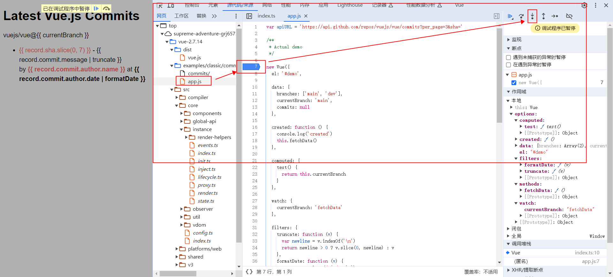
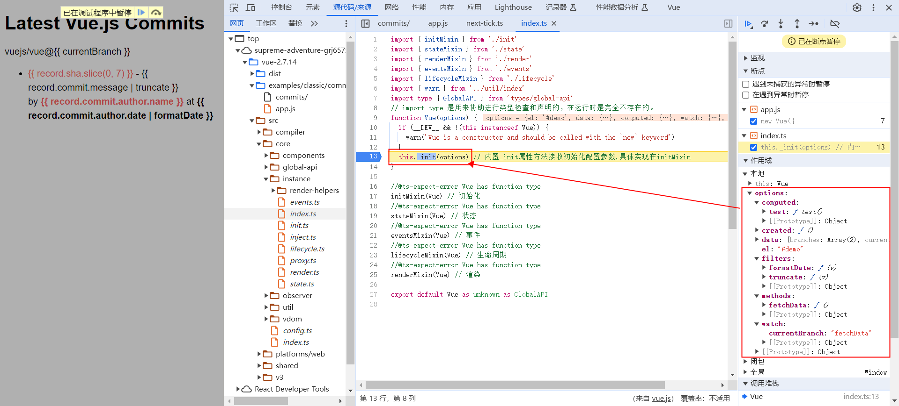
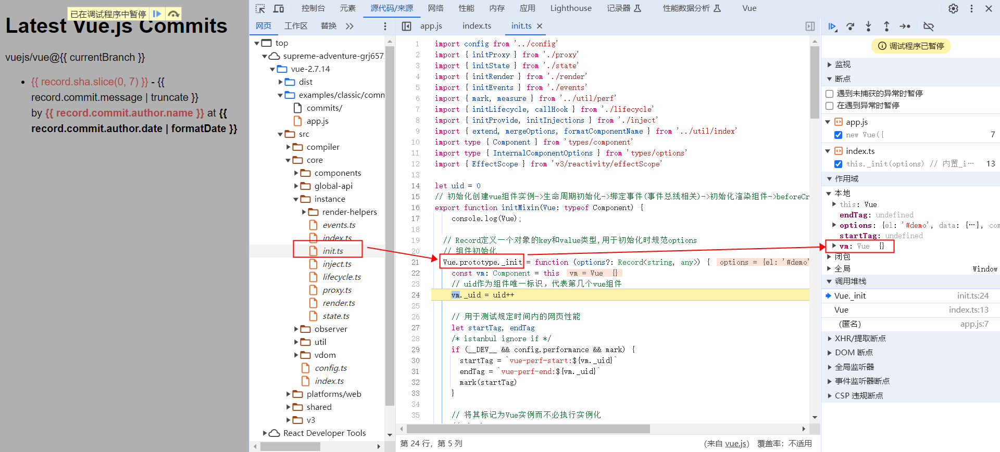
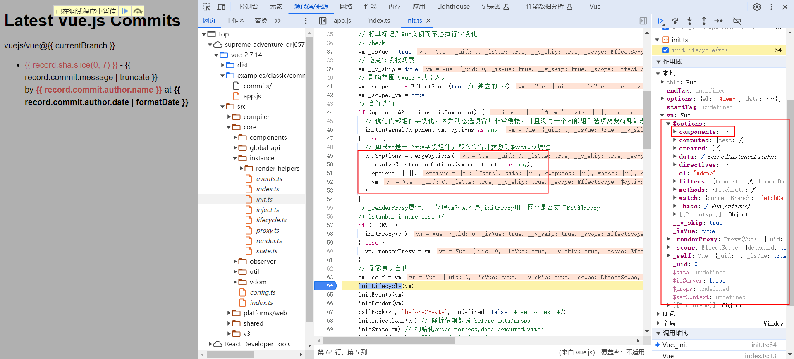

### new 一个 Vue 开始说起

建议配合[vue 源码系列-生命周期篇](https://vue-js.com/learn-vue/lifecycle/newVue.html#/_2-new-vue-%E9%83%BD%E5%B9%B2%E4%BA%86%E4%BB%80%E4%B9%88)一同观看学习，本文以源码中的[commits](../../examples/classic/commits/app.js)为例。

1. 在 new Vue 的代码行打上断点，刷新页面进入调试，进入下一个函数调用
   

2. options 配置初始化
   

3. [src/core/instance/init.ts](../../src/core/instance/init.ts) 部分重点代码

```javascript
export function initMixin(Vue) {
  Vue.prototype._init = function (options) {
    const vm = this
    vm.$options = mergeOptions(
      resolveConstructorOptions(vm.constructor),
      options || {},
      vm
    )
    vm._self = vm
    initLifecycle(vm)
    initEvents(vm)
    initRender(vm)
    callHook(vm, 'beforeCreate')
    initInjections(vm) // resolve injections before data/props
    initState(vm)
    initProvide(vm) // resolve provide after data/props
    callHook(vm, 'created')

    if (vm.$options.el) {
      vm.$mount(vm.$options.el)
    }
  }
}
```

进行一系列初始化，重点关注**vm**


**vm.\$options**

- 引入其他组件，实际上就是改变$options 中的 components，因此可以动态修改引入组件。
- directives：指令
- filters: 过滤
  

4. [initLifecycle](https://vue-js.com/learn-vue/lifecycle/initLifecycle.html#_2-initlifecycle%E5%87%BD%E6%95%B0%E5%88%86%E6%9E%90) 代码位置 src/core/instance/lifecycle.ts
   (ps:在源码中搜索 abstract，发现默认 abstract:true 的是内置组件 keep-alive，transition)

```javascript
export function initLifecycle(vm: Component) {
  const options = vm.$options

  // locate first non-abstract parent
  let parent = options.parent
  if (parent && !options.abstract) {
    while (parent.$options.abstract && parent.$parent) {
      parent = parent.$parent
    }
    parent.$children.push(vm)
  }

  vm.$parent = parent
  vm.$root = parent ? parent.$root : vm

  vm.$children = []
  vm.$refs = {}

  vm._provided = parent ? parent._provided : Object.create(null)
  vm._watcher = null
  vm._inactive = null
  vm._directInactive = false
  vm._isMounted = false
  vm._isDestroyed = false
  vm._isBeingDestroyed = false
}
```

5. [initEvents](https://vue-js.com/learn-vue/lifecycle/initEvents.html#_1-%E5%89%8D%E8%A8%80)
   初始化\_events 用于存储事件，将 parent 事件注册到子组件。

```javascript
export function initEvents(vm: Component) {
  vm._events = Object.create(null)
  vm._hasHookEvent = false
  // init parent attached events
  const listeners = vm.$options._parentListeners
  if (listeners) {
    updateComponentListeners(vm, listeners)
  }
}
```

事件绑定涉及模板编译，后续在模板编译篇再展开分析。

6. [initRender](../../src/core/instance/render.ts)

```javascript
export function initRender(vm: Component) {
  vm._vnode = null // the root of the child tree
  vm._staticTrees = null // v-once cached trees
  const options = vm.$options
  const parentVnode = (vm.$vnode = options._parentVnode!) // the placeholder node in parent tree
  const renderContext = parentVnode && (parentVnode.context as Component)
  vm.$slots = resolveSlots(options._renderChildren, renderContext)
  vm.$scopedSlots = parentVnode
    ? normalizeScopedSlots(
        vm.$parent!,
        parentVnode.data!.scopedSlots,
        vm.$slots
      )
    : emptyObject
  vm._c = (a, b, c, d) => createElement(vm, a, b, c, d, false)
  vm.$createElement = (a, b, c, d) => createElement(vm, a, b, c, d, true)
  const parentData = parentVnode && parentVnode.data
    defineReactive(
      vm,
      '$attrs',
      (parentData && parentData.attrs) || emptyObject,
      null,
      true
    )
    defineReactive(
      vm,
      '$listeners',
      options._parentListeners || emptyObject,
      null,
      true
    )
}
```
**createElement**用于生成vnode，后续再展开介绍。
**defineReactive**定义响应式数据，给vm添加\$atts,$listeners
