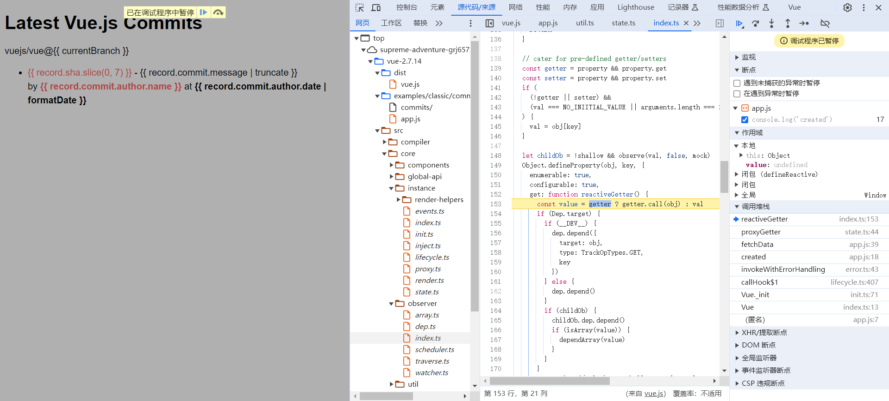
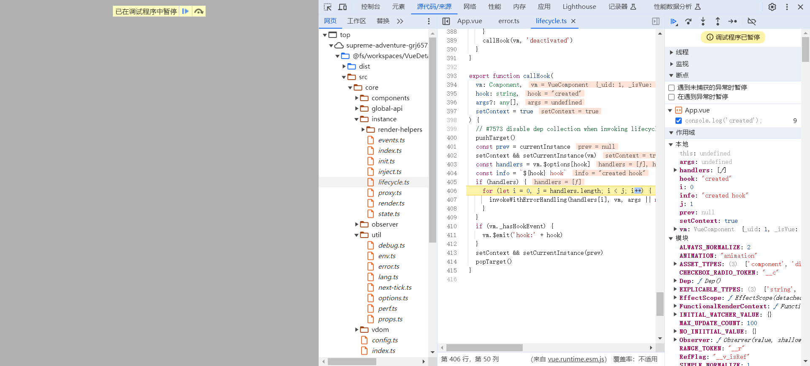

### vue2源码调试步骤

修改[**package.json**](../../package.json)来进行调试

1. **直接通过js引入调试**

使用rollup打包，主要配置在[scripts/config.js](../../scripts/config.js)。根据环境变量TARGET进行模式判断

```javascript
if (process.env.TARGET) {
  module.exports = genConfig(process.env.TARGET)
} else {
  exports.getBuild = genConfig
  exports.getAllBuilds = () => Object.keys(builds).map(genConfig)
}
```


此外，调试对应到**具体代码**需要在运行时加入 **--sourcemap**
```javascript
  "main": "dist/vue.js",
  "scripts": {
    "dev": "rollup -w -c scripts/config.js --environment TARGET:full-dev --sourcemap",
  }
```

运行
> npm run dev

成功截图


2. **项目通过npm link 方式引入vue调试**

打包形式为esm，因此要作对应修改，如下：
```javascript
  "main": "dist/vue.runtime.esm.js",
  "scripts": {
    "dev:esm": "rollup -w -c scripts/config.js --environment TARGET:runtime-esm --sourcemap",
  }
```

运行
```shell
npm run dev:esm

npm link
```

外部项目启动前，npm link vue，即可引入。(ps：这里的vue，是指package.json中的name)

成功截图
